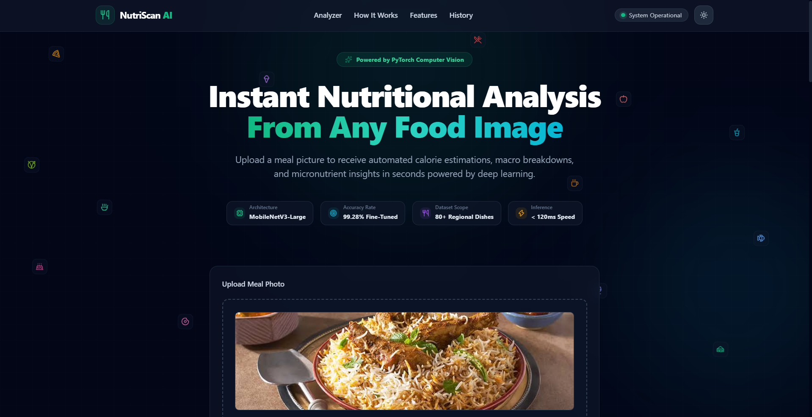
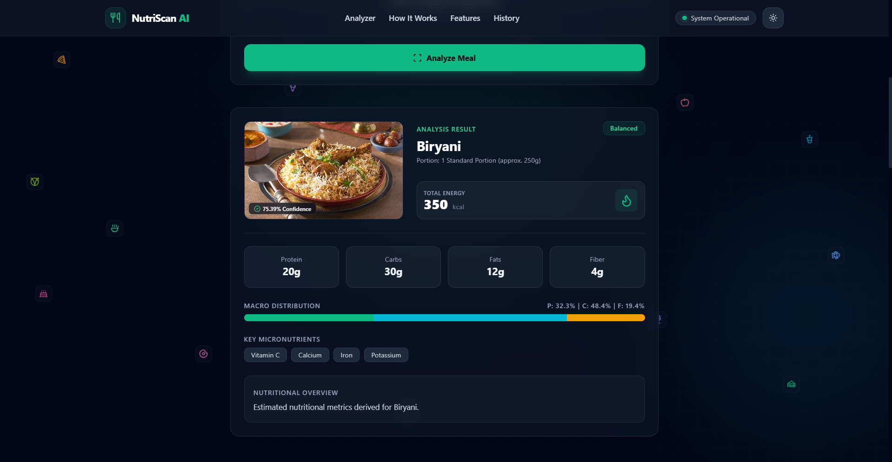

# NutriScan AI

**NutriScan AI** is an intelligent web application that analyzes food images and provides an automated nutritional breakdown. The application uses a fine-tuned MobileNetV3-Large deep learning model for food image classification and a Flask backend for image processing and inference.

The system identifies food categories and provides estimated calories, macronutrients, micronutrients, portion information, health ratings, and nutritional summaries.

## Key Features

- High-precision food image classification using MobileNetV3-Large
- Fine-tuned deep learning model with 99.28% reported accuracy
- Automated food recognition from uploaded images
- Calorie estimation
- Protein, carbohydrate, fat, and fiber information
- Micronutrient information
- Estimated serving and portion information
- Health rating and nutritional summary
- Modern responsive user interface
- Dark and light theme support
- Image upload with preview
- Recent analysis history
- Flask-based backend
- CPU and GPU-compatible PyTorch inference

## Model Architecture

NutriScan AI uses **MobileNetV3-Large**, a lightweight convolutional neural network architecture designed for efficient image classification.

The model was fine-tuned using CUDA for 12 epochs with a Cosine Annealing learning-rate schedule.

### Training Performance

    Epoch [1/12]  | Loss: 2.9700 | Accuracy: 35.33% | LR: 0.000983
    Epoch [6/12]  | Loss: 1.0278 | Accuracy: 96.05% | LR: 0.000500
    Epoch [12/12] | Loss: 0.8762 | Accuracy: 99.28% | LR: 0.000000

## Technology Stack

### Backend

- Python
- Flask
- PyTorch
- TorchVision
- Pillow
- Gunicorn

### Frontend

- HTML5
- Tailwind CSS
- JavaScript
- Lucide Icons

### Machine Learning

- MobileNetV3-Large
- PyTorch
- TorchVision
- Image preprocessing and normalization
- Softmax-based classification

## Project Structure

    NutriScan-AI/
    ├── static/
    │   ├── css/
    │   ├── js/
    │   └── uploads/
    ├── templates/
    │   └── index.html
    ├── model/
    │   ├── training/
    │   ├── evaluation/
    │   └── model files
    ├── app.py
    ├── class_names.json
    ├── requirements.txt
    ├── vercel.json
    └── README.md

## How It Works

    User Uploads Food Image
              |
              v
         Flask Backend
              |
              v
       Image Preprocessing
              |
              v
      MobileNetV3-Large Model
              |
              v
       Food Classification
              |
              v
      Nutritional Information
              |
              v
        Results Dashboard

## Quick Start

### 1. Prerequisites

Make sure Python 3.10 or later is installed.

### 2. Clone the Repository

    git clone https://github.com/MobeenFatimaa/NutriScan-AI.git
    cd NutriScan-AI

### 3. Create a Virtual Environment

#### Windows

    python -m venv venv
    venv\Scripts\activate

#### Linux/macOS

    python3 -m venv venv
    source venv/bin/activate

### 4. Install Dependencies

    pip install -r requirements.txt

### 5. Run the Application

    python app.py

Open the application in your browser:

    http://127.0.0.1:5000

## Model Deployment

The trained model is hosted separately because large PyTorch model files can exceed the deployment size limits of serverless platforms such as Vercel.

The model can be hosted on Hugging Face Hub while the Flask application remains on GitHub and Vercel.

This architecture keeps the GitHub repository and Vercel deployment lightweight while allowing the application to download or access the trained model when performing inference.

## Deployment Architecture

    GitHub
       |
       v
    Vercel
       |
       v
    Flask Application
       |
       v
    Hugging Face Hub
       |
       v
    MobileNetV3-Large Model

## Nutritional Analysis

After classification, NutriScan AI maps the detected food category to nutritional information including:

- Estimated serving size
- Calories
- Protein
- Carbohydrates
- Fats
- Dietary fiber
- Micronutrients
- Health rating
- Nutritional summary

The nutritional values are estimates and should not be considered a substitute for professional dietary or medical advice.

## Future Improvements

- Support for multiple foods in a single image
- More comprehensive nutritional databases
- Improved portion-size estimation
- Real-time camera-based food recognition
- User accounts and personalized nutrition tracking
- Nutrition goal tracking
- Meal history analytics
- Additional food classification categories
- API-based model inference

## Developed By

**Mobeen Fatima**

- GitHub: https://github.com/MobeenFatimaa
- LinkedIn: https://www.linkedin.com/in/mobeen-fatima-599a35347/
- Kaggle: https://www.kaggle.com/mobeenfatimah

## License

This project is intended for educational and research purposes.
